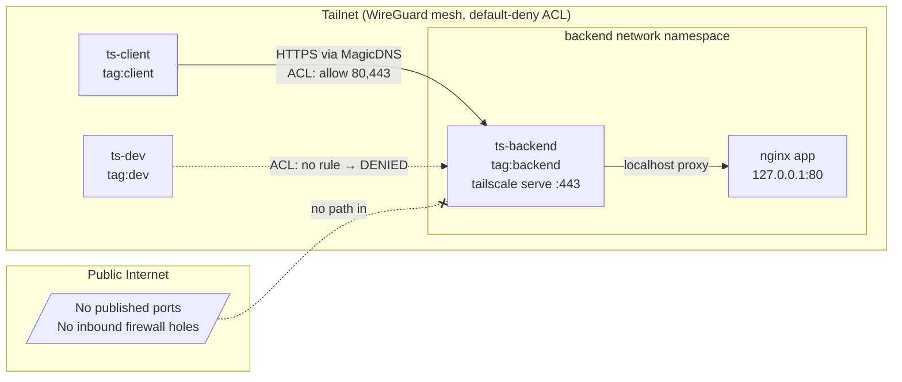

# Private Service over a Tailnet — no public ports, identity-based access

A private web dashboard and PostgreSQL database, both reachable only through a Tailnet. No public ports, no public DNS, and no inbound firewall rules.

## What I built

I set up a private internal web dashboard with nginx and a private PostgreSQL database. Both services are only reachable over a Tailnet, and neither one publishes a host port.

Three nodes join the same tailnet:

| Node | Tag | Role |
|---|---|---|
| `backend` | `tag:backend` | Hosts the dashboard and database, and serves over HTTPS |
| `client` | `tag:client` | Authorized developer node |
| `dev` | `tag:dev` | Unauthorized node that is blocked by policy |

Access is controlled by a single ACL. The `client` node can reach the backend on ports 80 and 443 for the dashboard, and 5432 for the database. The `dev` node cannot reach either one. That difference is the core of the demo, and the one-page demo cockpit (`make demo`) shows the full setup working end to end.

## Why this use case

This is the kind of problem Tailscale is built for: how do you let the right people or services reach something internal without exposing it to the internet or adding a bastion host?

This demo shows identity-based ACLs, tags, MagicDNS, HTTPS through `tailscale serve`, and Tailscale SSH. More importantly, it makes the security model easy to prove instead of just describe.

## Architecture



**Key design choice: the sidecar pattern.** The `app` container runs with `network_mode: service:ts-backend`, so it has no network identity of its own. Its only network presence is the backend’s tailnet membership. `tailscale serve` on the backend exposes nginx over the tailnet on port 80, which means reachability is controlled entirely by the ACL.

## How traffic flows

1. `client` resolves `backend.<tailnet>.ts.net` through MagicDNS.
2. The connection travels over the WireGuard mesh, which is encrypted end to end and usually goes direct after NAT traversal.
3. Before any packet is delivered, the ACL is checked: `tag:client → tag:backend` on `80,443` is allowed, and everything else — including all of `tag:dev` — is denied by default.
4. The backend serves nginx over the tailnet on port 80, with optional HTTPS through `tailscale serve`.

## Setup and deployment

**Prerequisites:** macOS or Linux with Docker running, plus `curl` and `jq`. You also need a Tailscale account.

```bash
# 0. One-time: apply the access policy in the Tailscale admin console.
#    Admin console → Access controls → paste policy.hujson → Save.
#    Create tag:backend / tag:client / tag:dev, owned by autogroup:admin.

# 1. Create a reusable + ephemeral auth key (Settings → Keys), then:
cp .env.example .env
$EDITOR .env                 # paste your tskey-auth-… key

# 2. One command, end to end:
./scripts/deploy.sh          # or: make deploy

#    ...or run the steps individually:
./scripts/bootstrap.sh       # preflight: Docker, jq, .env, compose
./scripts/start.sh           # start nodes, wait until online
./scripts/doctor.sh          # diagnostics + the six proofs below

# 3. Tear down
./scripts/stop.sh            # or: ./scripts/stop.sh --purge  (wipe state)
```

## How to validate it works

`./scripts/doctor.sh` (or `make doctor`) runs diagnostics plus six checks and exits non-zero if any fail:

1. **Web positive** — `client` curls the dashboard over HTTPS and expects HTTP 200.
2. **Web negative** — `dev` attempts the same and should be blocked by the ACL.
3. **DB positive** — `client` runs `pg_isready` against the private Postgres and expects it to be ready.
4. **DB negative** — `dev` runs `pg_isready` and should be blocked by the ACL.
5. **Isolation** — confirms `backend` exposes no published host port.
6. **Path** — `tailscale ping client → backend` confirms a direct encrypted link.

For the live walkthrough, use the demo cockpit instead of the CLI:

```bash
./scripts/demo.sh    # serves a single page at http://127.0.0.1:8700  (or: make demo)
```

It shows live node status and a button for each scenario. Each button runs the same command as above and lights up green when things work or red when something is wrong. It’s a clearer way to present the demo than a terminal, and it tells the story visually.

You can also inspect things manually:

```bash
docker compose exec ts-backend tailscale status            # peers + tags
docker compose exec ts-backend tailscale serve status      # what's published on the tailnet
BIP=$(docker compose exec -T ts-backend tailscale ip -4 | tr -d '\r')
docker compose exec client-probe curl --socks5 127.0.0.1:1055 http://$BIP/   # developer: 200
docker compose exec dev-probe curl --socks5 127.0.0.1:1055 --max-time 8 http://$BIP/  # attacker: blocked
```

## Assumptions and prerequisites

- A single Tailscale tailnet that you administer. The free tier is fine.
- The auth key is reusable, so all nodes can share it, and ephemeral, so reruns stay clean.
- Tags are advertised per node with `--advertise-tags`; this works because the key creator, you as admin, owns those tags in `policy.hujson`.

## What worked well

- The sidecar plus `tailscale serve` pattern makes “no exposed ports” structurally true, not just a policy choice.
- Default-deny ACLs turn security into something you can actually demonstrate, and the `dev` node failing is the strongest proof.
- Ephemeral reusable keys make the setup idempotent, so `make restart` gives you a clean tailnet every time.

## What was difficult

- TUN device availability inside Docker Desktop varies by host, so documenting the userspace fallback avoids a confusing first-run failure.
- Tests target the backend’s Tailscale IP, derived from `tailscale ip -4`, so traffic clearly crosses WireGuard where the ACL is enforced instead of a Docker bridge.
- A relayed DERP connection can make `tailscale ping` look like a failure even when it’s working, so that check is treated as informational rather than fatal.

## What I’d do with more time

- Move ACLs to GitOps and manage `policy.hujson` through the Tailscale GitHub Action so policy changes are reviewed in pull requests.
- Replace static auth keys with an OAuth client for short-lived, auto-tagged credentials.
- Add a subnet router node to show access to a private CIDR, plus a CI job that talks to the backend over the tailnet.

## Where I used AI

See `AI_DISCLOSURE.md`.

---

### Why Tailscale vs traditional approaches

| Traditional | Cost / risk | Tailscale here |
|---|---|---|
| Public LB + IP allowlist | Internet-facing attack surface; brittle IP lists | No public port at all |
| Bastion / jump host | A box to patch, key sprawl, lateral-movement risk | No bastion; identity is the perimeter |
| Classic VPN concentrator | Hub-and-spoke choke point; coarse network-level access | Direct WireGuard mesh; per-service ACLs |
| `ssh -L` port forwarding | Manual, unaudited, easy to leave open | Tailscale SSH: keyless, ACL-gated, logged |

One-line pitch: *The service stops having a public door. Identity decides who gets in, the connection is end-to-end encrypted by default, and you can prove the unauthorized node is locked out.*

---

### Repo layout

```text
docker-compose.yml     three tailnet nodes + private nginx + private postgres
serve.json             tailscale serve config (tailnet :80→nginx, :5432→postgres)
policy.hujson          default-deny ACL (paste into admin console)
.env.example           copy to .env, add your auth key (key never leaves your Mac)
app/index.html         the private dashboard page
scripts/
  bootstrap.sh         preflight checks
  start.sh / stop.sh   bring the stack up / down
  doctor.sh            diagnostics + the six validation checks
  deploy.sh            one-command: bootstrap → start → doctor
  demo.sh              launch the live cockpit
  lib.sh               shared helpers (Compose v1/v2 detection)
cockpit/               server.py + index.html  →  the live demo UI
docs/validation-evidence.md   a real 6/6 doctor.sh run + spot-checks
policy.hujson          the ACL
AI_DISCLOSURE.md       honest account of AI use (fill in the < EDIT > parts)
```