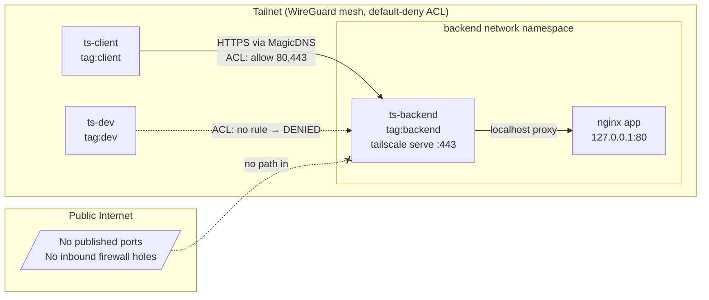

# Private Service over a Tailnet — no public ports, identity-based access

## 1. What I built (overview)

A private internal **web dashboard (nginx)** and a private **PostgreSQL database**,
both reachable **only** over a Tailnet. Neither publishes a host port and
neither has public DNS or an inbound firewall rule. Three nodes join one tailnet:

| Node         | Tag          | Role                                            |
|--------------|--------------|-------------------------------------------------|
| `backend`    | `tag:backend`| Hosts the dashboard + database; serves over HTTPS |
| `client`     | `tag:client` | The *authorized developer* (ACL allows it)      |
| `dev`        | `tag:dev`    | An *unauthorized node* (ACL has no rule → denied)|

Access is governed by a single, readable ACL. The developer (`client`) can reach the
backend on ports 80/443 (dashboard) and 5432 (database); the `dev` node cannot reach
either. That contrast is the demo — and a one-page **demo cockpit** (`make demo`) proves
the full system is operational.

## 2. Why this use case

It's the most common problem Tailscale answers: *"How do I let the
right people/services reach an internal thing without exposing it to the internet or
running a bastion?"* This demo shows: **identity-based ACLs, tags, MagicDNS, HTTPS via
`tailscale serve`, and Tailscale SSH** — and it makes the security posture *provable*.

## 3. Architecture



**Key design choice — the sidecar pattern:** the `app` (nginx) container runs with
`network_mode: service:ts-backend`. It has *no network of its own*. Its only network
identity is the backend's tailnet membership. `tailscale serve` on the backend
exposes nginx over the tailnet on port 80 — reachability is governed entirely by the ACL,
and there is no other door.

## 4. How traffic flows

1. `client` resolves `backend.<tailnet>.ts.net` via **MagicDNS**.
2. The connection rides the **WireGuard** mesh — encrypted point-to-point, usually a
   direct connection (NAT-traversed), falling back to a DERP relay only if needed.
3. Before any packet is delivered, the **ACL** is evaluated: `tag:client → tag:backend`
   on `80,443` is allowed; everything else (including all of `tag:dev`) is denied by
   default.
4. The backend serves nginx over the tailnet on port 80 (optionally HTTPS via `tailscale serve`).

## 5. Setup & deployment

**Prerequisites:** macOS/Linux with Docker running, plus `curl` and `jq`. A Tailscale account.

```bash
# 0. One-time: apply the access policy via Tailscale admin web
#    Admin console → Access controls → paste policy.hujson → Save.
#    Create tag:backend / tag:client / tag:dev, owned by autogroup:admin.

# 1. Create a reusable + ephemeral auth key (Settings → Keys), then:
cp .env.example .env
$EDITOR .env                 # paste your tskey-auth-… key

# 2. One command, end to end (preflight → start → health check):
./scripts/deploy.sh          # or: make deploy

#    …or run the steps individually:
./scripts/bootstrap.sh       # preflight: Docker, jq, .env, compose
./scripts/start.sh           # start nodes, wait until online
./scripts/doctor.sh          # diagnostics + the six proofs below

# 3. Tear down (ephemeral nodes auto-remove from the tailnet)
./scripts/stop.sh            # or: ./scripts/stop.sh --purge  (wipe state)
```

## 6. How to validate it works

`./scripts/doctor.sh` (or `make doctor`) runs diagnostics plus six checks and exits non-zero if any fail:

1. **Web positive** — `client` curls the dashboard over HTTPS → expects **HTTP 200**.
2. **Web negative** — `dev` attempts the same → expects it to be **blocked** (ACL).
3. **DB positive** — `client` runs `pg_isready` against the private Postgres → **ready**.
4. **DB negative** — `dev` runs `pg_isready` → expects it to be **blocked** (ACL).
5. **Isolation** — confirms `backend` exposes **no published host port**.
6. **Path** — `tailscale ping client → backend` confirms a direct encrypted link.

**For the live walkthrough, use the demo cockpit instead of the CLI:**
```bash
./scripts/demo.sh    # serves a single page at http://127.0.0.1:8700  (or: make demo)
```
It shows live node status and a button per scenario; each button runs the same command
as above and lights up green (allowed reached / attacker blocked) or red (something
wrong). It's the recommended way to present this in the interview — clearer than a
terminal, and it tells the before/after story visually.

You can also inspect manually:
```bash
docker compose exec ts-backend tailscale status            # peers + tags
docker compose exec ts-backend tailscale serve status     # what's published on the tailnet
BIP=$(docker compose exec -T ts-backend tailscale ip -4 | tr -d '\r')
docker compose exec client-probe curl --socks5 127.0.0.1:1055 http://$BIP/   # developer: 200
docker compose exec dev-probe    curl --socks5 127.0.0.1:1055 --max-time 8 http://$BIP/  # attacker: blocked
```

## 7. Assumptions & prerequisites

- A single Tailscale tailnet that you administer (free tier is fine).
- The auth key is **reusable** (all nodes share it) and **ephemeral** (clean re-runs).
- Tags are advertised per-node via `--advertise-tags`; this works because the key's
  creator (you, admin) owns those tags in `policy.hujson`.

## 8. What worked well

- The **sidecar + `tailscale serve`** pattern makes "no exposed ports" *structurally
  true*, not just policy — the app literally has no other network.
- **Default-deny ACLs** turn security into something you can *demonstrate*: the `dev`
  node failing is the most convincing slide in the deck.
- Ephemeral, reusable keys make the whole thing **idempotent** — `make restart`
  gives a clean tailnet every time.

## 9. What was difficult / surprising

- TUN device availability inside Docker Desktop varies by host; documenting the
  userspace fallback up front avoids a confusing first-run failure.
- Tests target the backend's Tailscale IP (derived from `tailscale ip -4`) so traffic
  provably crosses WireGuard, where the ACL is enforced — not a Docker bridge.
- A relayed (DERP) connection can make `tailscale ping` look like a "failure" when it's
  actually working — so check #4 is treated as informational, not fatal.

## 10. What I'd do with more time

- Move ACLs to **GitOps**: manage `policy.hujson` via the Tailscale GitHub Action so
  policy changes are reviewed in PRs.
- Replace static auth keys with an **OAuth client** for short-lived, auto-tagged creds.
- Add a **subnet router** node to show reaching a private CIDR (e.g. a database) and a
  CI job that talks to the backend over the tailnet.

## 11. Where I used AI

See `AI_DISCLOSURE.md`.

---

### Why Tailscale vs traditional approaches (for the walkthrough)

| Traditional                          | Cost / risk                                              | Tailscale here                                   |
|--------------------------------------|----------------------------------------------------------|--------------------------------------------------|
| Public LB + IP allowlist             | Internet-facing attack surface; brittle IP lists         | No public port at all                            |
| Bastion / jump host                  | A box to patch, key sprawl, lateral-movement risk        | No bastion; identity is the perimeter            |
| Classic VPN concentrator             | Hub-and-spoke choke point; coarse network-level access   | Direct WireGuard mesh; per-service ACLs          |
| `ssh -L` port-forwarding             | Manual, unaudited, easy to leave open                    | Tailscale SSH: keyless, ACL-gated, logged        |

One-line pitch: *"The service stops having a public door. Instead, identity decides who
gets in, the connection is end-to-end encrypted by default, and you can prove the
unauthorized node is locked out."*

---

### Repo layout

```
docker-compose.yml     three tailnet nodes + private nginx + private postgres
serve.json             tailscale serve config (tailnet :80→nginx, :5432→postgres)
policy.hujson          default-deny ACL (paste into admin console)
.env.example           copy to .env, add your auth key (key never leaves your Mac)
app/index.html         the private dashboard page
scripts/
  bootstrap.sh         preflight checks
  start.sh / stop.sh   bring the stack up / down
  doctor.sh            diagnostics + the six validation checks
  deploy.sh            one-command: bootstrap → start → doctor
  demo.sh              launch the live cockpit
  lib.sh               shared helpers (Compose v1/v2 detection)
cockpit/               server.py + index.html  →  the live demo UI
docs/validation-evidence.md   a real 6/6 doctor.sh run + spot-checks
policy.hujson          the ACL
AI_DISCLOSURE.md       honest account of AI use (fill in the < EDIT > parts)
```
